# Ember Outpost — 2D Pixel Asset Production Pipeline

**Author:** Art Director & Technical Artist  
**Status:** Approved Standard Operating Procedure  

---

## 1. Pipeline Overview

Every visual asset in Ember Outpost—from ground tiles to mascot animations and particle effects—passes through a rigorous 9-stage pipeline to guarantee stylistic cohesion, performance, and cross-platform browser compatibility.

```mermaid
flowchart LR
    A[1. Concept & Thumbnail] --> B[2. Asset Specification]
    B --> C[3. Generation & Pixel Drafting]
    C --> D[4. Palette & Edge Cleanup]
    D --> E[5. Texture Optimization]
    E --> F[6. Sprite Sheet Compilation]
    F --> G[7. Phaser Import & Atlas Setup]
    G --> H[8. In-Game Rigging & VFX]
    H --> I[9. Browser Testing & Visual QA]
```



---

## 2. The Nine Pipeline Stages

### Stage 1: Concept & Thumbnail
* **Objective:** Establish the silhouette, proportions, and visual purpose.
* **Requirements:**
  - Fast low-resolution thumbnail sketched on a 32x16 isometric grid.
  - Review against surrounding settlement elements to prevent visual clutter.
  - Verification: Does the object have a distinct silhouette when viewed in pure black-and-white?

### Stage 2: Asset Specification
* **Objective:** Define technical bounds before pixel drafting.
* **Fields Documented:**
  - ID / File Name (e.g., `building_workshop_lv1.png`)
  - Pixel dimensions (e.g., `64 × 64 px`)
  - Footprint on isometric grid (e.g., `2 × 2 tiles`)
  - Anchor point / origin (e.g., `origin: (0.5, 0.75)` for isometric base grounding)
  - Collision box (width, height, offset)
  - Interactive radius (e.g., `48px` radial circle)

### Stage 3: Generation & Pixel Drafting
* **Objective:** Render the raw pixel art asset according to Art Bible rules.
* **Rules:**
  - Adhere strictly to the 2:1 isometric ratio (2 horizontal pixels per 1 vertical pixel).
  - Apply the canonical 24-color Ember Outpost palette.
  - Establish clear light direction (universal top-left key light).

### Stage 4: Palette & Edge Cleanup
* **Objective:** Remove stray pixels and enforce rendering standards.
* **Checklist:**
  - [ ] No orphan pixels ("jaggies" eliminated on curves).
  - [ ] No mixed pixel resolutions ("no mixels").
  - [ ] External outline uses `#070A13` or `#0F172A`.
  - [ ] Color count verified (zero interpolated alpha fringes).

### Stage 5: Texture Optimization
* **Objective:** Lossless compression and memory minimization.
* **Tools:** `pngcrush` / `optipng` / indexed color quantizers.
* **Rules:**
  - PNG-32 or PNG-8 with indexed palette.
  - All transparent areas cleared to `#00000000` to prevent compression artifacts.

### Stage 6: Sprite Sheet & Atlas Compilation
* **Objective:** Package individual frames into efficient sprite sheets.
* **Standards:**
  - Multi-frame animations packed into uniform grid sheets or TexturePacker JSON atlases.
  - mascot animations packed into `mascot_ignis_sheet.png` (24x32 frame grid with uniform padding).
  - Metadata file generated: `mascot_ignis.json` defining frame names, durations, and anchor offsets.

### Stage 7: Phaser Import & Animation Setup
* **Objective:** Load and register the assets into Phaser 3 scene memory.
* **Code Standard:**
  ```typescript
  this.load.spritesheet('ignis', 'assets/sprites/ignis_keeper.png', {
    frameWidth: 24,
    frameHeight: 32
  });
  ```
* **Animation Registration:**
  - Define animations in `src/rendering/AnimationManager.ts` using structured frame sequences and explicit framerates (e.g., 6 fps for idle, 10 fps for walk).

### Stage 8: In-Game Rigging & Visual Layering
* **Objective:** Place asset in world space with proper depth and physics.
* **Rules:**
  - Isometric depth sorting: `sprite.setDepth(sprite.y + zIndexOffset)`.
  - Add particle emitters (e.g., ember chimney sparks, crystal glow aura).
  - Bind interaction triggers and contextual prompt placement.

### Stage 9: Browser Validation & Visual QA
* **Objective:** Inspect rendering quality live in the target browsers (Chrome, Edge, Safari, Mobile WebKit).
* **Criteria Evaluated:**
  - Is the asset crisp at 1x, 2x, and 3x device pixel ratios?
  - Does the character depth-sort correctly when walking behind and in front of the building?
  - Are draw calls minimized? (Outpost scene target: < 15 draw calls).
  - Frame rate sustained at 60 FPS without garbage collection stutter.

---

## 3. Asset Versioning & Directory Structure

All asset source files and production builds are structured cleanly in the project:

```text
public/
  assets/
    audio/
      bgm/
      sfx/
    fonts/
      press_start_2p.woff2
    sprites/
      characters/
        ignis_keeper.png
        ignis_keeper.json
      buildings/
        outpost_core.png
        workshop.png
        storage.png
        production_hub.png
        training_station.png
        defense_tower.png
        friend_gate.png
        challenge_board.png
      environment/
        tileset_ground.png
        props_nature.png
        props_decor.png
      vfx/
        particles.png
      ui/
        hud_icons.png
        dialog_box.png
        touch_controls.png
```
