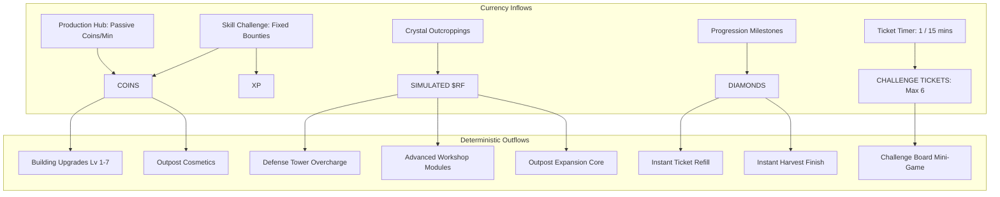

# Ember Outpost — Deterministic Economy Model & Tokenomics

**Lead Economy Designer:** Studio Lead & Economy Architect  
**Target Category:** Economy Potential  
**Status:** Approved Mathematical & Economic Specification  

---

## 1. Core Economic Philosophy: Deterministic & Positive-Sum

Ember Outpost is intentionally designed as an antidote to predatory Web3 casino mechanics. It replaces negative-sum gambling, loot boxes, and RNG payouts with a **100% deterministic, transparent, positive-sum production and skill economy**.

---

## 2. The Four Currencies

| Currency | Tier | Determinism | Sources | Primary Sinks & Uses |
|---|---|---|---|---|
| **COINS** | Primary Gameplay | 100% Deterministic | • Production Hub yields • Precision challenge rewards • Outpost quest completions | • Base building upgrades • Local tool repairs • Standard cosmetic banners |
| **DIAMONDS** | Convenience / QoL | 100% Deterministic | • Outpost level-up rewards • Achievement unlocks • Daily login stipend | • Instant ticket energy refill • Quality-of-life automation toggles |
| **SIMULATED $RF** | Ecosystem Utility | 100% Deterministic | • Node harvesting in outskirts • Rivalry milestone badges • Simulated portfolio grant | • High-tier outpost expansion • Workshop efficiency research • Defense Tower 24h overcharge |
| **XP** | Player & Outpost Level | 100% Deterministic | • Successful challenge clears • Completing building upgrades • Active play milestones | • Unlocking Outpost Levels 1–7 • Expanding physical base boundaries |

---

## 3. Tickets & Energy Loop (Session Pacing)

To prevent bot exploitation and ensure healthy, engaging session design, friend challenges are regulated by a deterministic Ticket Loop.

* **Starting Pool:** 6 Tickets
* **Max Capacity:** 6 Tickets
* **Consumption:** Exactly 1 Ticket per challenge run.
* **Natural Regeneration:** Exactly 1 Ticket recovered every **15 minutes** (90 minutes to fully recharge from 0 to 6).
* **Convenience Bypass:** 10 Diamonds can instantly refill the ticket pouch to 6.
* **Economic Safety:** No real fiat or crypto payment is accepted for ticket refills in the MVP. It is completely governed by simulated in-game resources.

---

## 4. Production Hub Mathematical Model

The Production Hub passively generates Coins over time based on an exponential tier curve:

$$\text{Coin Rate} = 10 \times (1.8)^{\text{Tier} - 1} \quad \text{coins/min}$$

$$\text{Storage Cap} = 500 \times (2.2)^{\text{Storage Tier} - 1} \quad \text{coins}$$

### Rate & Capacity Progression Table:

| Hub Tier | Base Output (Coins/Min) | Hourly Output | Storage Tier | Max Uncollected Capacity | Fill Time (Hours) |
|---|---|---|---|---|---|
| **Tier 1** | 10.0 | 600 | **Tier 1** | 500 | 0.83 hrs |
| **Tier 2** | 18.0 | 1,080 | **Tier 2** | 1,100 | 1.02 hrs |
| **Tier 3** | 32.4 | 1,944 | **Tier 3** | 2,420 | 1.24 hrs |
| **Tier 4** | 58.3 | 3,498 | **Tier 4** | 5,324 | 1.52 hrs |
| **Tier 5** | 105.0 | 6,300 | **Tier 5** | 11,712 | 1.86 hrs |
| **Tier 6** | 189.0 | 11,340 | **Tier 6** | 25,768 | 2.27 hrs |
| **Tier 7** | 340.1 | 20,406 | **Tier 7** | 56,690 | 2.78 hrs |

*All yields pause once the Storage Vault hits maximum capacity, encouraging regular check-ins.*

---

## 5. Simulated $RAREFRIENDS ($RF) Design & Sinks

### The Core Ecosystem Question:
> *"Why would the Rare Friends ecosystem benefit from being connected to Ember Outpost?"*

### The Answer:
In traditional crypto games, tokens are dumped into high-emission inflation or consumed in random gambling pools. In Ember Outpost, **$RF serves as the high-prestige, deterministic catalyst for Outpost Mastery**:

1. **Strategic Overcharge (The Defense Siphon):**
   - Cost: 50 Simulated $RF
   - Effect: Grants 24 hours of +15% global production efficiency and automated resource collection.
   - Economic impact: Continuous, deterministic sink with zero inflation.
2. **High-Tier Outpost Unlocks:**
   - Levels 3–7 demand cumulative $RF allocation (totalling 1,600 $RF) to construct monumental structures like the Friend Gate and Apex Foundry.
3. **Mascot Prestige Customization:**
   - Simulated $RF allows the Outpost Keeper to forge distinct cosmetic cloaks and particle halos that signal prestige to visiting friends.
4. **Zero Cashout / Zero Speculation:**
   - $RF cannot be cashed out, staked in casino pools, or converted into lottery tickets. It represents **functional mastery and ecosystem pride**.

---

## 6. Friend Challenge Precision Economy

Challenges award deterministic Coin and XP pools based entirely on player input accuracy:

$$\text{Final Score} = \sum_{i=1}^{5} \left( \text{Base Points}_i \times \text{Combo Multiplier}_i \right)$$

### Rank & Payout Matrix:

| Score Bracket | Performance Rank | Coin Reward | XP Reward | Rivalry Record Impact |
|---|---|---|---|---|
| **450 – 500** | **Rank S (Flawless)** | **100 Coins** | **50 XP** | Guaranteed Win vs Average Rival |
| **350 – 449** | **Rank A (Master)** | **75 Coins** | **35 XP** | High Win Probability |
| **250 – 349** | **Rank B (Competent)**| **50 Coins** | **20 XP** | Moderate Contest |
| **0 – 249** | **Rank C (Novice)** | **25 Coins** | **10 XP** | Likely Loss vs Rival |

*If two friends challenge the same weekly board, the higher score claims the match victory, updating their lifetime Rivalry Dossier.*

---

## 7. Absolute Non-Negotiable Economic Safety Audit

| Requirement | Implementation Verification | Status |
|---|---|---|
| **Zero Gambling** | No roulette, dice rolls, coin flips, or randomized prize loot boxes. | **COMPLIANT** |
| **Zero Wagers** | Friends cannot stake tokens against one another; rewards come from fixed game pools. | **COMPLIANT** |
| **Deterministic Outcomes** | 100% of costs, yields, and scores follow public mathematical formulas. | **COMPLIANT** |
| **Simulated MVP Scope** | Zero on-chain contracts; zero wallet private key interactions; zero real money. | **COMPLIANT** |
| **Anti-Pay-to-Win** | Skill challenges rely strictly on timing reflex; paid perks only expand convenience. | **COMPLIANT** |
