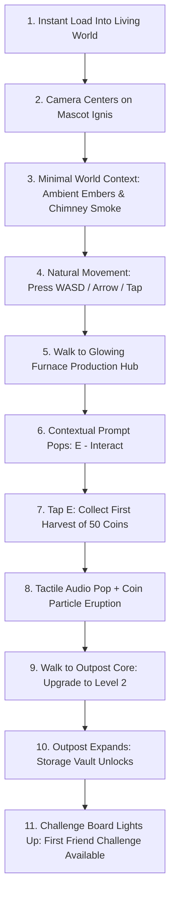

# Ember Outpost — Comprehensive Gameplay Design Document

**Lead Designers:** Game Director & Senior Gameplay Designer  
**Target Audience:** Browser & Mobile Casual-Core Strategy Players  
**Target Category:** Economy Potential  
**Status:** Approved Master Design Specification  

---

## 1. High Concept & Fantasy

In **Ember Outpost**, the player assumes the mantle of an **Outpost Keeper**—a resilient guardian commanding an ancient, floating ember-powered settlement in a mystical cyberpunk frontier adjacent to the Rare Friends universe.

Unlike spreadsheet simulators or menu-heavy crypto apps, Ember Outpost is a **physical, living world**. The player physically navigates their mascot ("Ignis") through isometric streets, harvesting raw ember nodes, stoking production furnaces, reinforcing energy defense arrays, and engaging in high-precision friend challenges to etch their outpost's legacy into the stars.

---

## 2. The First 30 Seconds: Onboarding Through the World

The new player experience is engineered to captivate within seconds without presenting overwhelming HUDs or confusing crypto jargon.



### Scripted 11-Step Onboarding Flow:
1. **0:00–0:03:** Instant canvas initialization. No wallet popup. The player sees Ignis standing in a vibrant isometric courtyard illuminated by ambient lanterns and floating sparks.
2. **0:04–0:06:** Mascot plays a curious idle animation. A subtle floating prompt `[WASD / Tap to Move]` appears near the feet, then gently fades.
3. **0:07–0:10:** Player moves. Camera follows with smooth lerp damping (`lerp: 0.1`). Footstep dust puffs emerge.
4. **0:11–0:14:** Mascot approaches the **Production Hub** (a bustling brass and stone furnace puffing amber smoke).
5. **0:15–0:17:** A crisp world-space badge appears: `[E] Harvest Coins`.
6. **0:18–0:20:** Player presses `E` (or taps). A satisfying chime rings, 50 Coins fly in parabolic arcs to the HUD counter, which rolls up dynamically.
7. **0:21–0:24:** An animated arrow points to the nearby **Outpost Core** with the prompt `[E] Upgrade Outpost`.
8. **0:25–0:27:** Opening the core modal displays deterministic benefits: +25% Production, unlocks the Storage Vault. Player clicks `[ UPGRADE ]`.
9. **0:28–0:30:** A pillar of cyan energy erupts over the Outpost Core. Level 2 achieved!
10. **0:31+:** The **Challenge Board** emits a glowing beacon: "Rival Incoming!" The social skill loop is discovered organically.

---

## 3. Character Profile: "Ignis the Keeper"

* **Visual Identity:** Compact, agile bipedal mascot with a stylized twilight-indigo cloak, bright ember-gold ocular visor, and a flowing coral scarf that reacts dynamically to movement velocity.
* **Proportions:** 24px wide by 32px tall. Large expressive eye visor capable of blinking, widening in surprise, or narrowing with competitive focus.
* **13 Required Animation States:**
  1. `idle`: 4 frames, rhythmic 1px breathing bob, scarf drifting in breeze.
  2. `idle-variation`: 6 frames, Ignis inspects an ember crystal or adjusts their scarf.
  3. `walk-up` (North-East isometric): 6 frames, back-facing stride.
  4. `walk-down` (South-West isometric): 6 frames, front-facing energetic run.
  5. `walk-left` (North-West isometric): 6 frames, profile run.
  6. `walk-right` (South-East isometric): 6 frames, profile run.
  7. `interact`: 3 frames, swift forward reach with glowing hand emitter.
  8. `collect`: 3 frames, upward catch with sparkle absorption.
  9. `upgrade-success`: 5 frames, excited 2-hand cheer, scarf flapping wildly.
  10. `challenge-start`: 4 frames, crouch into focused ready-stance.
  11. `victory`: 6 frames, celebratory 360-degree spin and fist pump.
  12. `defeat`: 4 frames, comical dizzy wobble with floating sweat bead.
  13. `celebration`: Continuous loop, joyful bounce with confetti particles.

---

## 4. The 19 Independent Gameplay Systems

Each system is encapsulated in its own distinct architecture module:

### 1. Movement System (`src/systems/MovementSystem.ts`)
* 8-directional vector input normalized to constant speed (120 px/sec).
* Isometric projection matrix: `screenX = (worldX - worldY) * cos(30°)`, `screenY = (worldX + worldY) * sin(30°)`.
* Instant deceleration with 0.05s smoothing to avoid slippery control feeling.

### 2. Camera System (`src/systems/CameraSystem.ts`)
* Smooth linear interpolation (`lerp: 0.1`) tracking mascot position.
* Deadzone: 32x32px center bounding box preventing micro-jitter while stationary.
* Hard world clamping to outpost boundary extents: prevents camera from panning into the void.

### 3. Collision System (`src/systems/CollisionSystem.ts`)
* Arcade Physics 2D axis-aligned and diamond isometric collision bodies.
* Player collision footprint: circular base (radius 8px) centered at the mascot’s feet.
* Obstacle bodies set on building foundation tiles, trees, and perimeter fences.

### 4. Contextual Interaction System (`src/systems/InteractionSystem.ts`)
* Radius checks (48px) from mascot feet to interactive world anchors.
* Priority resolver: if two buildings overlap in radius, selects the closest anchor to center screen.
* World-space prompt renderer: floats 16px above the targeted entity, animating with a gentle sine-wave bob.

### 5. Resource Collection System (`src/systems/HarvestSystem.ts`)
* Harvestable crystal outcroppings and passive building drop-boxes.
* Triggering harvest generates floating particle sprites that follow bezier trajectories to the HUD counters.
* Zero RNG: collection yield is strictly determined by building tier and passive booster stats.

### 6. Building Interaction System (`src/systems/BuildingSystem.ts`)
* Clicking or pressing `E` pauses mascot walking and opens the building's dedicated interface modal.
* Background world continues rendering in a soft-focus darkened state (dimmed by 40%).

### 7. Building Upgrade System (`src/systems/UpgradeSystem.ts`)
* Validates cost against current Coin and Simulated $RF reserves.
* Atomic transaction execution: deducts cost, increments building tier, refreshes stats, triggers upgrade VFX and audio fanfare.
* Saves state immediately upon completion.

### 8. Production Hub System (`src/systems/ProductionSystem.ts`)
* Continuous background tick calculating accrued Coins: `Coins = RatePerSecond * ElapsedSeconds`.
* Fully supports offline time accumulation up to the maximum capacity dictated by the Storage Vault.

### 9. Storage Vault System (`src/systems/StorageSystem.ts`)
* Defines hard caps for Coins and harvestable materials.
* Level 1: 500 Coins -> Level 7: 50,000 Coins.
* Visual fullness indicator on the building sprite in the world (open/closed vault door).

### 10. Training Station System (`src/systems/TrainingSystem.ts`)
* Exercises the mascot's attributes:
  - *Reflex Speed:* Extends the "Perfect" timing window in challenges by +5ms per level.
  - *Focus Multiplier:* Increases base XP earned per successful challenge by +10%.

### 11. Defense Tower System (`src/systems/DefenseSystem.ts`)
* Protects the outpost against simulated wilderness decay and storm events.
* Overcharge Mechanic: Player can allocate Simulated $RF to "Overcharge" the tower for 24 hours, boosting entire outpost production efficiency by +15% deterministically.

### 12. Friend Challenge System (`src/systems/ChallengeSystem.ts`)
* "The Forge Sync" precision timing mini-game.
* Uses 1 Challenge Ticket (out of 6 max).
* A high-frequency oscillating needle travels across a calibrated timing meter with 4 distinct zones.
* Player taps/presses Spacebar during 5 consecutive rhythm pulses.
* Performance tiers:
  - **PERFECT (Gold Zone, ±8ms):** 100 pts + 2.0x Combo
  - **EXCELLENT (Cyan Zone, ±20ms):** 75 pts + 1.5x Combo
  - **GOOD (White Zone, ±40ms):** 40 pts + 1.0x Combo
  - **MISS (Outer Red Zone):** 0 pts + Combo Reset
* Deterministic Outcome: Final Score ranks player into Rank S (450+), Rank A (350+), Rank B (250+), or Rank C (<250), awarding a fixed Coin bounty and XP.

### 13. Achievement System (`src/systems/AchievementSystem.ts`)
* 15 milestone achievements tracking settlement expansion, perfect challenge runs, and rivalry streaks.
* Awards permanent decorative outpost banners and title tags.

### 14. Outpost Progression System (`src/systems/ProgressionSystem.ts`)
* Outpost Level 1 to 7 progression tree. Unlocks new buildings, expanded land area, and higher-tier upgrades.
* Requires combined conditions: Outpost XP, Coin investment, and optional Simulated $RF milestones.

### 15. Persistence System (`src/persistence/PersistenceManager.ts`)
* Local storage state serialization with schema versioning (`schemaVersion: 1`).
* Automatic debounced saving (every 5 seconds or upon state mutation).
* Corruption safeguard: checksum verification and fallback to safe defaults.

### 16. Audio System (`src/audio/AudioManager.ts`)
* Web Audio API architecture with sound manager.
* Handles browser autoplay policies via transparent "Click to Start" gesture unlock.
* Independent volume buses: Master, Music, SFX.

### 17. Visual Effects System (`src/rendering/VFXSystem.ts`)
* Object-pooled particle systems for sparks, smoke, coin showers, and impact rings.
* Strict memory caps: maximum 60 concurrent particles to prevent mobile frame drops.

### 18. UI System (`src/ui/UIManager.ts`)
* Decoupled HTML/Canvas hybrid UI.
* HUD elements render crisply on top of game canvas with zero layout thrashing.

### 19. Responsive & Mobile Input System (`src/input/InputManager.ts`)
* Unified input adapter: automatically detects touch-enabled viewports.
* Dynamically mounts a virtual floating analog joystick on screen left and an `[ACTION]` button on screen right.

---

## 5. Outpost Progression Tree (Balanced Levels 1–7)

| Level | Outpost Title | Coin Cost | Sim $RF Cost | XP Req | Unlocks & Key Benefits |
|---|---|---|---|---|---|
| **Lv 1** | *Ember Hearth* | Starting | 0 | 0 | Mascot Ignis, Outpost Core Lv1, Production Hub Lv1 (10 Coins/min), Challenge Board. |
| **Lv 2** | *Kindled Camp* | 250 | 0 | 100 | Storage Vault Lv1 (Cap: 1,000 Coins), Production Hub Lv2 (25 Coins/min). |
| **Lv 3** | *Brass Outpost* | 750 | 25 | 300 | Workshop Lv1 (Efficiency research unlocked), Training Station Lv1 (+5ms Perfect window). |
| **Lv 4** | *Aether Bastion*| 2,000 | 75 | 750 | Defense Tower Lv1 (Overcharge available), Storage Vault Lv2 (Cap: 5,000 Coins). |
| **Lv 5** | *Friend Gate* | 5,000 | 150 | 1,500 | Friend Gate Unlocked! Inspect friend outposts, challenge rival profiles, earn rivalry badges. |
| **Lv 6** | *Apex Foundry* | 12,000 | 350 | 3,000 | Production Hub Lv3 (100 Coins/min), Workshop Lv2 (Double upgrade speed). |
| **Lv 7** | *Ember Citadel* | 30,000 | 1,000 | 6,500 | Outpost Master status, permanent glowing aura for Ignis, legendary Citadel banner. |

---

## 6. Friend Rivalry System (Social Loop)

Ember Outpost pioneers an asynchronous, skill-based social loop.

### Rivalry Profile Example:
```text
========================================
         RIVALRY DOSSIER
      IGNIS (YOU) vs ALEX (RIVAL)
========================================
Matches Played:    14
Wins:              9
Losses:            5
Win Streak:        3 (Current)
Best Score:        492 (Rank S - Perfect Run)
Last Result:       VICTORY (+75 Coins)
----------------------------------------
UNLOCKED RIVALRY BADGES:
[★ First Blood] [★ Rival Crusher] [★ 5-Streak Master]
========================================
```

### Deterministic Reward Structure:
* **No Wagers:** Neither player stakes coins or tokens.
* **Predetermined Bounties:**
  - Rank S: 100 Coins + 50 XP
  - Rank A: 75 Coins + 35 XP
  - Rank B: 50 Coins + 20 XP
  - Rank C: 25 Coins + 10 XP
* **Outcome Reproducibility:** Every challenge run produces a cryptographic-style input seed validating that results derive purely from tap timestamps.

---

## 7. Skill vs. Power Principle

To maintain impeccable competitive integrity:
* **Skill is Supreme:** An un-upgraded Level 1 player with exceptional timing reflexes can hit Rank S (450+ pts) and achieve victory over a Level 7 player who misses notes.
* **$RF Utility Enhances, Never Substitutes:** Simulated $RF grants cosmetic prestige, outpost efficiency, and comfort buffers (such as wider timing forgiveness or automated harvest logistics), but **never grants automatic wins**.
