# Ember Outpost — Master Phased Implementation Roadmap

**Production Manager & Studio Lead**  
**Project:** Ember Outpost  
**Status:** Canonical Phased Schedule  

---

## Phased Lifecycle Architecture

```mermaid
flowchart LR
    P0[Phase 0: Pre-Prod] --> P1[Phase 1: Vertical Slice]
    P1 --> P2[Phase 2: World Expansion]
    P2 --> P3[Phase 3: Deep Buildings]
    P3 --> P4[Phase 4: Full Economy]
    P4 --> P5[Phase 5: Friend Challenge]
    P5 --> P6[Phase 6: Audio & VFX]
    P6 --> P7[Phase 7: Mobile & A11y]
    P7 --> P8[Phase 8: Visual Polish]
    P8 --> P9[Phase 9: End-to-End QA]
    P9 --> P10[Phase 10: Deployment]
```

---

## Phase Details & Deliverables

### PHASE 0: Research & Pre-Production (COMPLETED)
* **Goal:** Complete forensic reference analysis, art bible, asset manifests, gameplay design, economy equations, technical architecture, and QA plans.
* **Deliverables:**
  - `PROJECT_RULES.md`
  - `docs/research/reference-comparison.md`
  - `docs/research/competitive-opportunity.md`
  - `docs/art/art-bible.md`
  - `docs/art/asset-pipeline.md`
  - `docs/art/asset-manifest.md`
  - `docs/gameplay/gameplay-design.md`
  - `docs/economy/economy-model.md`
  - `docs/architecture/technical-architecture.md`
  - `docs/vertical-slice/vertical-slice-spec.md`
  - `docs/vertical-slice/vertical-slice-plan.md`
  - `docs/qa/TEST_PLAN.md`
  - `docs/submission/submission-checklist.md`
* **Exit Gate:** 10 Studio Artifacts generated; owner signoff on roadmap.

---

### PHASE 1: Playable Visual Vertical Slice (NEXT TASK)
* **Goal:** Prove core locomotion, camera, depth sorting, 4 buildings, ambient embers, and aesthetic beauty.
* **Deliverables:**
  - Vite + TypeScript + Phaser 3 scaffolding.
  - Mascot Ignis with 4-way animations.
  - Isometric Outpost courtyard with depth sorting.
  - 4 interactive structures with proximity prompts and inspect modals.
  - Ambient particle emitters and Day BGM loop.
* **Exit Gate:** 60 FPS verified in browser; visually stunning screenshot captured.

---

### PHASE 2: World Expansion & Environment Art
* **Goal:** Expand from the micro-courtyard to the full Outpost Mesa, Resource Forest outskirts, and boundary cliffs.
* **Deliverables:**
  - Complete 2.5D isometric tileset (ground, paths, cliffs, elevations).
  - Harvestable ember crystal outcroppings and ancient trees.
  - Environmental decorative props (fences, lanterns, logistics crates).
* **Exit Gate:** Seamless world traversal with robust collision boundaries.

---

### PHASE 3: Buildings, Upgrades & Outpost Management
* **Goal:** Implement full functionality for all 8 settlement structures.
* **Deliverables:**
  - Outpost Core (Levels 1–7 visual and functional tiers).
  - Production Hub (Accrues passive coins, harvest collection).
  - Workshop (Tech tree and efficiency research).
  - Storage Vault (Capacity limits and visual fullness states).
  - Defense Tower (Overcharge mechanics).
* **Exit Gate:** All 8 buildings have functional modals, upgrade trees, and world state updates.

---

### PHASE 4: Full Economy Engine & Persistence
* **Goal:** Complete 4-currency model (Coins, Diamonds, Simulated $RF, XP) and reliable saving.
* **Deliverables:**
  - `LocalEconomyService` with deterministic math.
  - `PersistenceManager` with schema versioning and checksum verification.
  - Ticket regeneration timer (1 ticket / 15 mins).
  - Offline accumulation calculations upon game boot.
* **Exit Gate:** Browser reload preserves all balances, levels, and building upgrades flawlessly.

---

### PHASE 5: Friend Challenge & Rivalry System
* **Goal:** Implement "The Forge Sync" precision timing mini-game and head-to-head friend rivalries.
* **Deliverables:**
  - Real-time rhythm/timing challenge gauge with Perfect, Excellent, Good, and Miss zones.
  - 5-beat rhythm sequence with dynamic combo multipliers.
  - Deterministic scoring, fixed Coin bounties, and XP awards.
  - Friend Gate & Rivalry Dossier (`Ignis vs Alex`), match history, and unlockable badges.
* **Exit Gate:** Reproducible, skill-based mini-game with verifiable scores and dossier updates.

---

### PHASE 6: Audio Director & VFX Overdrive
* **Goal:** Elevate sensory immersion to commercial indie standard.
* **Deliverables:**
  - Complete 5-track soundtrack (Outpost Day, Outpost Night, Challenge, Victory, Menu).
  - Full SFX library (footsteps, harvest pops, upgrade fanfare, hit rings, UI clicks).
  - Advanced particle emitters (molten forge sparks, upgrade energy pillars, shockwaves).
* **Exit Gate:** Seamless Web Audio playback with volume buses and zero audio clipping.

---

### PHASE 7: Mobile Optimization & Accessibility
* **Goal:** Ensure flawless mobile touch controls and accessibility standards.
* **Deliverables:**
  - Virtual floating analog joystick and tactile `[ACTION]` touch button.
  - Responsive viewport scaling supporting landscape and portrait orientations.
  - Settings panel: Reduced motion toggle, high contrast mode, master/BGM/SFX sliders.
* **Exit Gate:** Tested and verified on mobile viewports (iOS Safari / Android Chrome).

---

### PHASE 8: Visual Polish & Anti-Slop Audit
* **Goal:** Studio-wide aesthetic critique and micro-refinement.
* **Deliverables:**
  - Frame-by-frame animation smoothing on Ignis.
  - Sub-pixel edge verification and lighting cookie balancing.
  - Micro-interactions (hover sounds, button depressions, screen shakes on Perfect hits).
* **Exit Gate:** Zero aesthetic flaws; screenshot matches high-end indie title standards.

---

### PHASE 9: End-to-End QA & Regression Testing
* **Goal:** Execute the full Test Plan (`docs/qa/TEST_PLAN.md`).
* **Deliverables:**
  - Vitest test suite passing (economy math, offline rates, persistence schema).
  - Interactive browser test suite across 19 systems.
  - P0–P3 bug triage and resolution.
* **Exit Gate:** Zero P0/P1 defects; 100% regression checklist passes.

---

### PHASE 10: Production Deployment & Vibeathon Submission
* **Goal:** Deploy static bundle to public host and prepare submission PR.
* **Deliverables:**
  - Production Vite build (`dist/`) optimized and minified.
  - Static deployment to GitHub Pages.
  - Completed `submissions/ember-outpost/README.md` conforming to Vibeathon standards.
* **Exit Gate:** Live public link playable by judges on desktop and mobile without a wallet.
