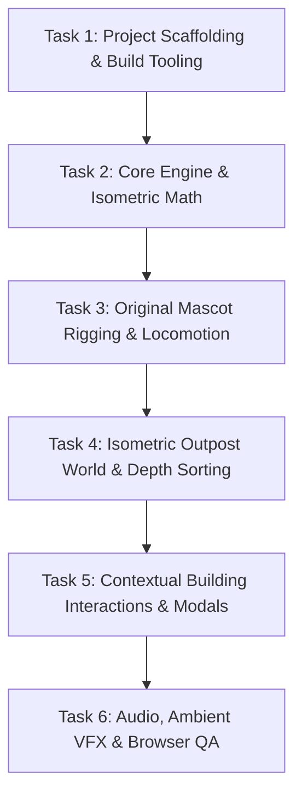

# Ember Outpost — Phase 1 Playable Vertical Slice Implementation Plan

**Lead Production Manager & Technical Director**  
**Milestone:** Phase 1 Playable Vertical Slice  
**Target Execution:** Verifiable, Modular Steps  
**Status:** Approved for Implementation  

---

## 1. Execution Overview

To prevent unmaintainable code generation, Phase 1 implementation is organized into **six sequential, verifiable tasks**. Each task produces measurable output, compiles cleanly, and is validated in an active browser session before proceeding to the next.

---

## 2. Detailed Task Breakdown

### Task 1: Project Scaffolding & Tooling Setup
* **Files Created/Configured:**
  - `package.json` (Phaser 3.80+, TypeScript, Vite, Vitest)
  - `tsconfig.json` (Strict type checking, ES2022)
  - `vite.config.ts` (Relative base `./` for static GitHub Pages)
  - `index.html` (Pixelated canvas container, viewport meta)
* **Verification Checkpoint:**
  - `npm.cmd install` succeeds.
  - `npm.cmd run dev` serves the application at `http://localhost:5173` without errors.

### Task 2: Core Engine, Event Bus & Isometric Math
* **Files Created:**
  - `src/core/GameConfig.ts`: Phaser canvas sizing, scale mode (`FIT`), Arcade Physics.
  - `src/core/EventBus.ts`: Typed event dispatcher for cross-system communication.
  - `src/rendering/IsoMath.ts`: Cartesian-to-isometric and isometric-to-Cartesian conversion functions.
  - `src/scenes/BootScene.ts`: Initial loading sequence.
* **Verification Checkpoint:**
  - Game canvas mounts cleanly in the browser with an obsidian background `#070A13`.

### Task 3: Original Mascot Rigging, Animation & Locomotion
* **Files Created:**
  - `src/entities/MascotKeeper.ts`: Mascot class extending `Phaser.Physics.Arcade.Sprite`.
  - `src/rendering/AnimationManager.ts`: Procedural or sheet-based frame registrations for Idle and Walk cycles (North, South, East, West).
  - `src/input/InputManager.ts`: Normalizing keyboard WASD/Arrows and click-to-move vectors.
  - `src/systems/MovementSystem.ts`: Applying normalized velocity along isometric axes.
* **Verification Checkpoint:**
  - Player controls Ignis across the screen. Correct walk animations play depending on direction. Sprite drops a contact shadow.

### Task 4: Isometric Outpost Mesa & Depth Layering
* **Files Created:**
  - `src/scenes/OutpostScene.ts`: Isometric tilemap / grid rendering.
  - `src/rendering/DepthSorter.ts`: Real-time Y-sorting algorithm.
  - Outpost layout: Ground obsidian tiles, stone paths, cliff boundary walls, ambient cyber-trees, ember crystal props.
* **Verification Checkpoint:**
  - Camera follows Ignis smoothly. Mascot collides with cliff perimeters. Depth sorting functions perfectly (walking behind trees and structures occludes the mascot appropriately).

### Task 5: 4 Interactive Buildings & Contextual Prompts
* **Files Created:**
  - `src/entities/BuildingNode.ts`: Interactive building container (Outpost Core, Production Hub, Workshop, Challenge Board).
  - `src/systems/InteractionSystem.ts`: 48px proximity detector and animated `[E] Interact` world prompt.
  - `src/ui/BuildingModal.ts`: High-contrast modal dialogue displaying building information and simulated actions.
* **Verification Checkpoint:**
  - Approaching any building displays the prompt. Pressing `E` halts movement and opens the modal. Pressing `Escape` or clicking `[X]` resumes play.

### Task 6: Ambient Lighting, VFX, Audio & Visual Signoff
* **Files Created:**
  - `src/rendering/ParticleFactory.ts`: Ember spark emitters for chimneys and lanterns.
  - `src/audio/AudioManager.ts`: Web Audio manager with BGM looping and interaction sound effects.
  - `src/ui/HUDController.ts`: Minimalist top resource bar (Coins, Diamonds, Simulated $RF, Tickets).
* **Verification Checkpoint:**
  - Chimney smoke and floating ember particles active. BGM plays upon first user click. Full browser screenshot captured for studio visual review.
